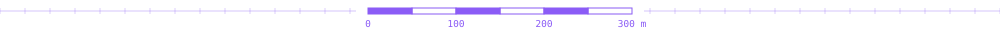
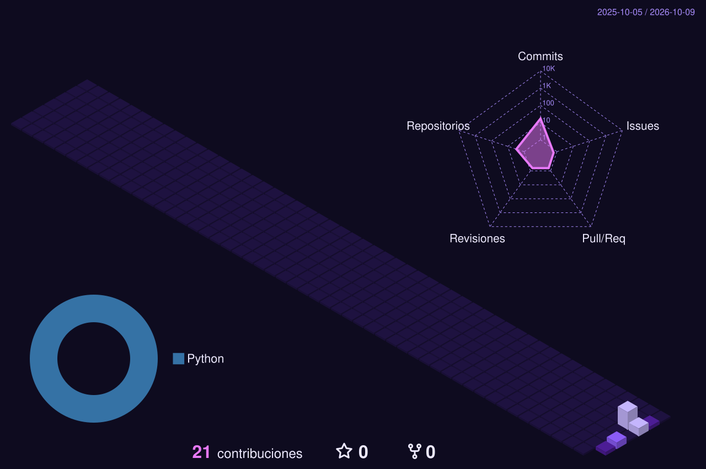

<!--
  README de perfil de GitHub · Deysa Katherine Pulido Valenzuela
  Usuario de GitHub: kathpulido.
  Todos los widgets, salvo el contador de visitas, los genera la acción .github/workflows/widgets.yml.
-->

## 📊 Mi GitHub en números

### 🔥 Racha de contribuciones

### 📈 Actividad del último mes

### 🏆 Logros

## 🏔️ Relieve de mis contribuciones

Cada día es una columna: entre más contribuciones, más alta. Como un modelo digital de elevación, pero de código.

## 🐍 La serpiente que recorre mi año

<picture>
  <source media="(prefers-color-scheme: dark)" srcset="profile/snake-dark.svg" />
  <source media="(prefers-color-scheme: light)" srcset="profile/snake-light.svg" />
  
</picture>

## 💜 Mujeres que miden el mundo

Escribo **ingeniera**, con *a*. Nombrar también es una forma de medir.

Cada vez somos más mujeres en la topografía, la geodesia y el catastro. El violeta de este perfil no es casualidad.

